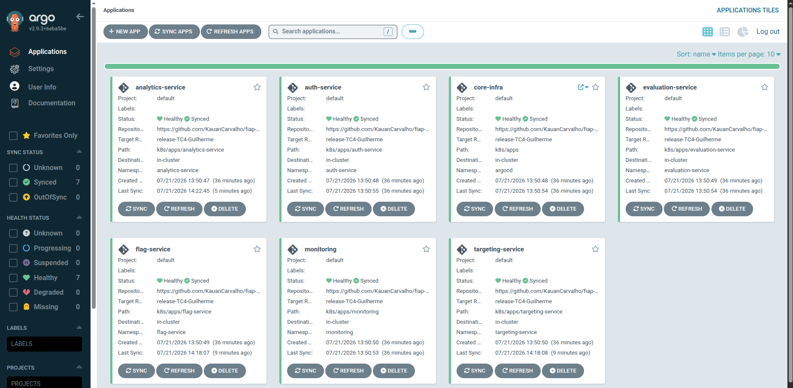
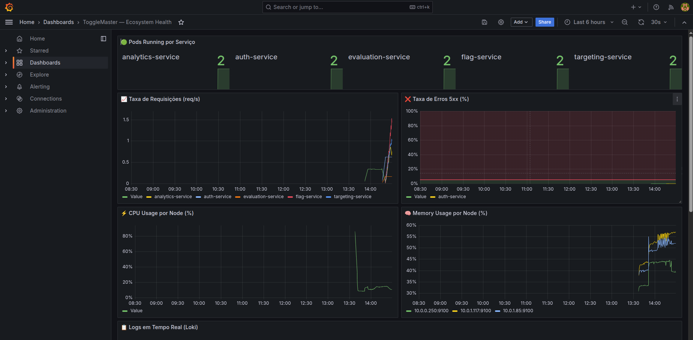
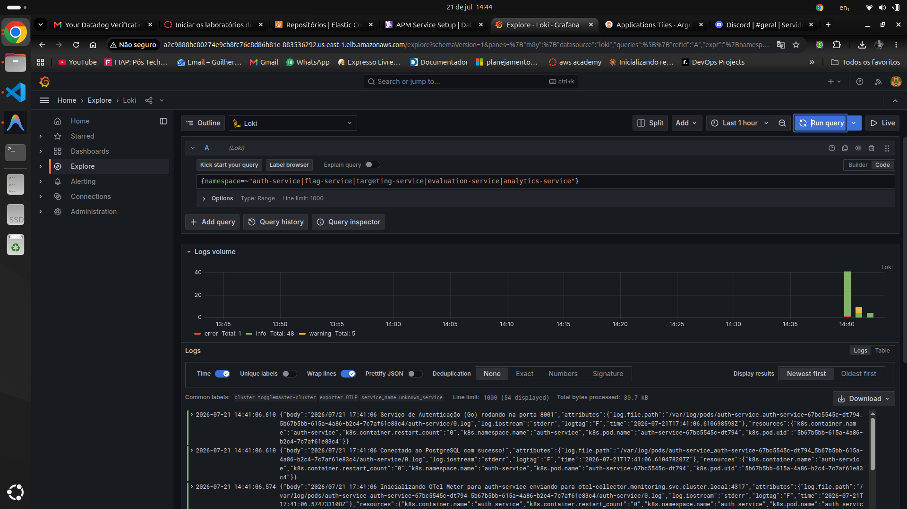
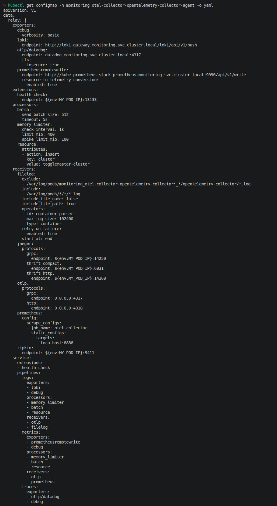
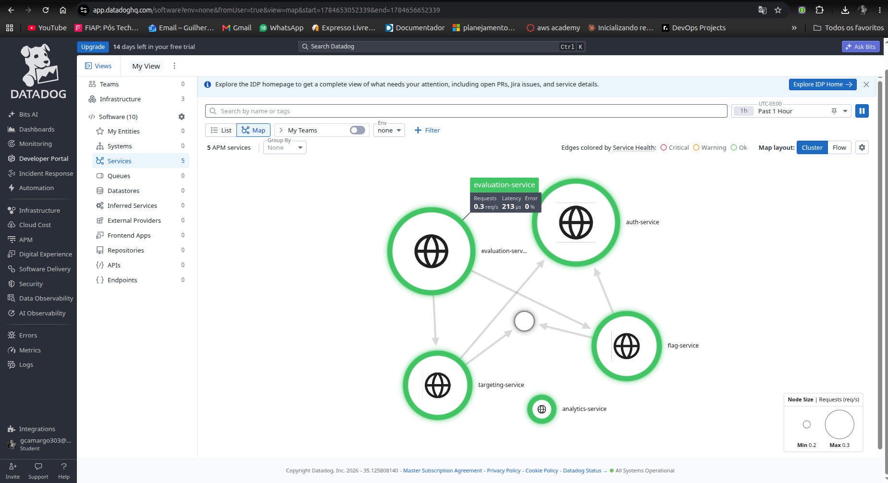
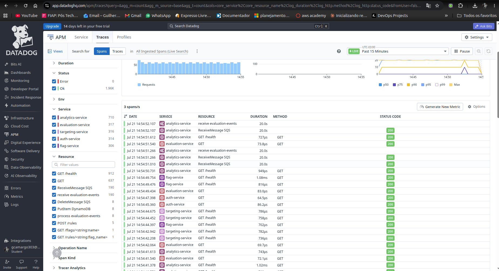
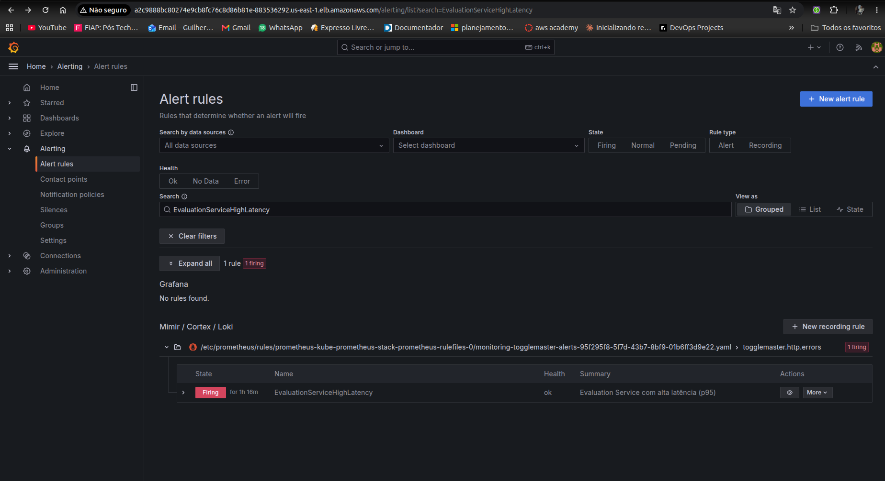
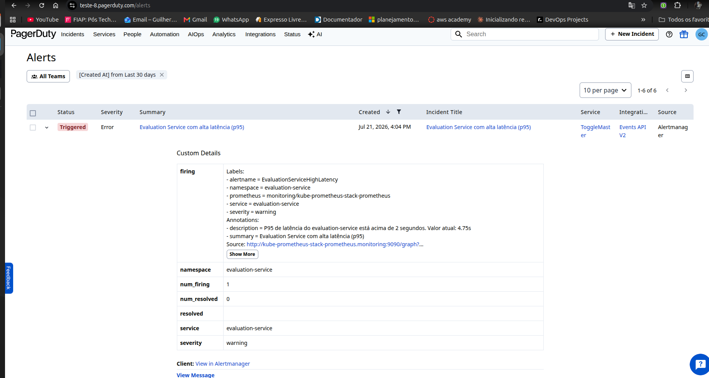
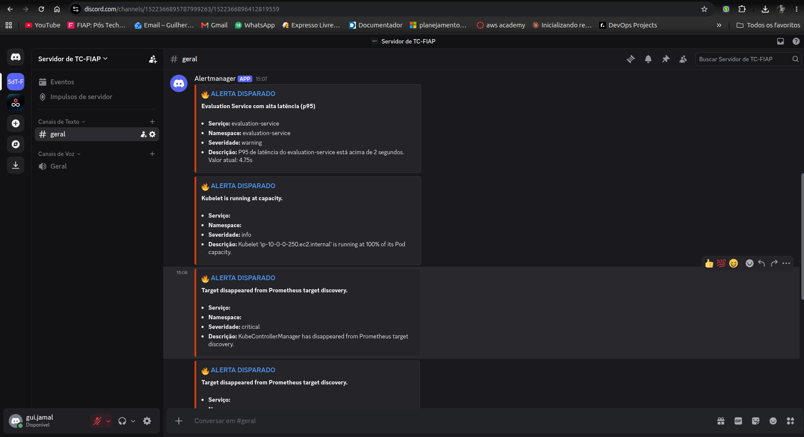
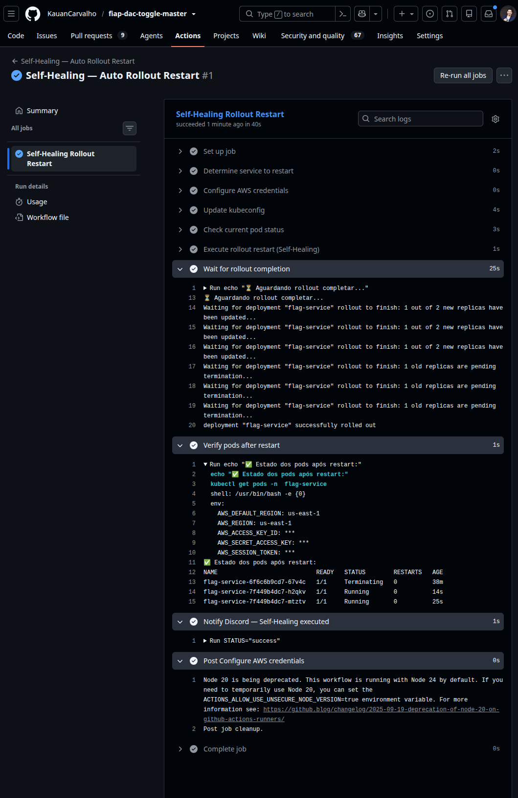

# Toggle Master — Tech Challenge [Fase 4]

Turma: **2DCLT** — DevOps e Arquitetura Cloud Pós Tech.

## Integrantes do Grupo

| Nome | RM |
| :--- | :--- |
| Guilherme Correa Camargo | 369954 |
| Kauan Carvalho Calasans | 370203 |
| Pedro Henrique Coittinho Marcondes de Andrade | 369367 |

## Documentação de Vídeo

O vídeo técnico detalha a stack de observabilidade (Prometheus, Loki, Grafana, OTel Collector), o APM (Datadog), os alertas inteligentes e a automação de Self-Healing em resposta a um incidente real.

- Link da Demonstração (YouTube): https://youtu.be/Xh8UolKAS0w

---

## 1. Visão Geral do Projeto

Este Tech Challenge é a conclusão da jornada com o projeto **ToggleMaster**. A Fase 4 instrumenta os microsserviços com OpenTelemetry, adiciona uma stack de monitoramento Opensource, integra uma solução de APM comercial e configura automação de resposta e mitigação de incidentes — tudo rodando **em cima** da base já consolidada nas Fases 1, 2 e 3 (5 microsserviços conteinerizados, infraestrutura via Terraform, pipelines de CI/CD com DevSecOps e implantação via GitOps/ArgoCD).

### Componentes do Ecossistema

| Microsserviço | Linguagem | Responsabilidade | Persistência / Infra |
| :--- | :--- | :--- | :--- |
| **Auth Service** | Go | Gestão de Identidade e API Keys | RDS (PostgreSQL) |
| **Flag Service** | Python | CRUD de Feature Flags | RDS (PostgreSQL) |
| **Targeting Service** | Python | Regras de Segmentação | RDS (PostgreSQL) |
| **Evaluation Service** | Go | Motor de Decisão (Caminho Crítico) | ElastiCache (Redis) |
| **Analytics Service** | Python | Processamento de Eventos | SQS + DynamoDB |



---

## 2. Infraestrutura como Código (Terraform) — base das Fases anteriores

O provisionamento da AWS é realizado de forma modular e centralizada, garantindo a replicabilidade do ambiente. A stack de observabilidade da Fase 4 (seção 6 em diante) foi adicionada em cima dessa mesma infraestrutura, no repositório GitOps.

### Recursos Gerenciados

| Recurso | Descrição | Configuração |
| :--- | :--- | :--- |
| **Remote Backend** | S3 + DynamoDB | Armazenamento de Estado Imutável e Lock de Concorrência. |
| **VPC & IA** | Networking | Subnets Isoladas (Privadas/Públicas) e NAT Gateways. |
| **IAM (LabRole)** | Identidade | Integração com AWS Academy utilizando Role pré-existente (inclusive para a Lambda de self-healing, ver seção 8). |
| **Cluster EKS** | Orquestração | Node Groups Gerenciados com Node Selectors. |
| **RDS Instances** | Databases | 3 Instâncias isoladas para conformidade de dados. |
| **ElastiCache** | Cache | Cluster Redis para alta performance do Evaluation Service. |
| **ECR Repos** | Registry | 5 Repositórios privados com scan de imagem ativado. |

---

## 3. Pipeline CI e DevSecOps (GitHub Actions)

O ciclo de vida de desenvolvimento é blindado por ferramentas de análise estática e segurança. A pipeline é acionada em cada Pull Request e Push na rama `main`.

### Estágios Implementados

| Estágio | Ferramenta | Descrição | Status |
| :--- | :--- | :--- | :--- |
| **Build & Test** | Native Compilers | Compilação e execução de testes unitários. | [x] |
| **Static Analysis** | Linters | Verificação de conformidade de estilo e sintaxe. | [x] |
| **SCA** | **Trivy (fs)** | Análise de vulnerabilidades em bibliotecas de terceiros. | [x] |
| **SAST** | **Gosec / Bandit** | Busca por padrões inseguros no código-fonte em Go e Python. | [x] |
| **Container Scan** | **Trivy (image)** | Verificação de vulnerabilidades na imagem final gerada. | [x] |
| **Docker Push** | AWS ECR | Envio da imagem tagueada com `COMMIT_SHA`. | [x] |

---

## 4. Fluxo de Entrega Contínua e GitOps

O deploy das aplicações não é feito via CLI direta. Adotamos o modelo de **Pull Synchronization** através do GitOps.

### Processo de Sincronização

1.  **Geração do Artefato**: Após a aprovação da pipeline de CI, uma imagem Docker é enviada ao ECR.
2.  **Atualização de Manifesto (GitHub App)**: A pipeline utiliza um **GitHub App** (token de curta duração) para clonar o repositório externo de manifestos ([fiap-dac-toggle-master-gitops](https://github.com/KauanCarvalho/fiap-dac-toggle-master-gitops)). O arquivo `deployment.yaml` é atualizado programaticamente com a nova tag da imagem e o commit é realizado automaticamente no repositório de GitOps.
3.  **Observabilidade e Sync (ArgoCD)**: O ArgoCD monitora o repositório de GitOps. Ao detectar o novo commit, ele identifica o "drift" (diferença) entre o estado desejado (Git) e o estado atual (EKS) e realiza o deploy atômico de forma automática.

### Vantagens do Modelo
- **Single Source of Truth**: O repositório GitOps define exatamente o que está rodando.
- **Auditoria**: Todo deploy tem um registro de autoria via commits do GitHub App.
- **Recuperação de Desastre**: Reinstalar o ambiente completo a partir do ArgoCD leva minutos.

---

## 5. Validação da Integridade do Ecossistema

Para homologar a integração entre os serviços e a infraestrutura Cloud, disponibilizamos um script de exaustão que valida o fluxo do Hot Path (Avaliação de Flags) e a persistência de eventos assíncronos.

### Execução de Testes Automatizados

Antes faça replace das envs no arquivo `.env.prod.sample` para `.env.prod`.

```bash
make check-all ENV=prod
```

---

## 6. Fase 4 — Observabilidade, APM e Self-Healing

A implementação da Fase 4 está dividida em dois repositórios:

- **Este repositório**: instrumentação de código das aplicações (traces + métricas via OpenTelemetry) e automação de Self-Healing.
- **Repositório GitOps** ([fiap-dac-toggle-master-gitops](https://github.com/KauanCarvalho/fiap-dac-toggle-master-gitops)): stack de monitoramento (Prometheus, Loki, Grafana, OTel Collector, Datadog Agent), regras de alerta, integrações (PagerDuty/Discord) e a automação serverless que conecta os alertas ao Self-Healing.

### 6.1. Monitoramento Opensource (Métricas e Logs no K8s)

Stack provisionada via `helm_release` no Terraform do repositório GitOps (`terraform/production/monitoring.tf`), orquestrada pelo ArgoCD App `monitoring`:

| Componente | Chart / versão | Função |
|---|---|---|
| **Prometheus** | `kube-prometheus-stack` 61.3.2 | Armazenamento e consulta de métricas de infraestrutura e das aplicações (`enableRemoteWriteReceiver: true` para receber do OTel Collector) |
| **Grafana** | incluso no `kube-prometheus-stack` | Visualização, exposto via `LoadBalancer`, datasources Prometheus + Loki provisionados automaticamente |
| **Loki** | `grafana/loki` 6.6.4 | Centralização e indexação de logs (modo `SingleBinary`, storage filesystem) |
| **kube-state-metrics** / **node-exporter** | incluso no `kube-prometheus-stack` | Métricas de estado dos deployments/pods e de recursos dos nodes |

**Acesso rápido:**

| Ferramenta | Como acessar |
|---|---|
| Grafana | `terraform output -raw grafana_url` (LoadBalancer público) — login `admin` / senha em `monitoring.tf` |
| Prometheus | `kubectl port-forward -n monitoring svc/kube-prometheus-stack-prometheus 9090:9090` (ClusterIP) |
| Loki | Sem UI própria — via datasource do Grafana (Explore) ou `kubectl port-forward -n monitoring svc/loki-gateway 3100:80` |

#### Dashboard customizado

Provisionado via ConfigMap (`k8s/apps/monitoring/grafana-dashboard.yaml`, repo GitOps), carregado automaticamente pelo sidecar do Grafana. Título: **"ToggleMaster — Ecosystem Health"** (uid `togglemaster-health`), com painéis de:

- Pods rodando por serviço (`kube_deployment_status_replicas_available`)
- Taxa de requisições por serviço, em req/s (`http_requests_total`)
- Taxa de erros 5xx, em % (`http_requests_total{status=~"5.."}`)
- Uso de CPU e memória por node (`node_cpu_seconds_total`, `node_memory_MemAvailable_bytes`)
- Logs em tempo real (datasource Loki, filtrando pelos namespaces dos 5 microsserviços)
- Latência p95 por serviço (`http_request_duration_seconds_bucket`)





### 6.2. OpenTelemetry (OTel) e Padronização

O **OTel Collector** roda como `DaemonSet` (chart `open-telemetry/opentelemetry-collector`) e é o único ponto de entrada de telemetria dos 5 microsserviços — nenhum deles fala diretamente com Prometheus, Loki ou Datadog. Os serviços enviam traces e métricas via OTLP (gRPC 4317 / HTTP 4318), e o Collector roteia cada sinal para o backend correto:

| Pipeline | Receivers | Exporters |
|---|---|---|
| `traces` | `otlp` | `otlp/datadog` (Datadog Agent) |
| `logs` | `otlp` + `filelog` (via `presets.logsCollection`, direto dos containers) | `loki` |
| `metrics` | `otlp` + `prometheus` (self-metrics do Collector) | `prometheusremotewrite` |

O Grafana Alloy não foi usado (opcional conforme o desafio); o Collector padrão da comunidade (`otel/opentelemetry-collector-contrib`) foi a escolha.



### 6.3. Instrumentação e APM (Traces e Visibilidade Profunda)

**Ferramenta escolhida:** Datadog (conta educacional gratuita), via `helm_release.datadog` — OTLP receiver habilitado na porta 4317, APM e coleta de logs ativos. Pipelines de log customizados corrigem falsos-positivos de status `ERROR` nos logs do Loki/nginx que escrevem em stderr por padrão.

#### Instrumentação por serviço

| Serviço | Linguagem | Traces | Métricas |
| :--- | :--- | :--- | :--- |
| **auth-service** | Go | SDK manual do OTel (`TracerProvider`, exporter `otlptracegrpc`, propagador `TraceContext + Baggage`), servidor envolto em `otelhttp.NewHandler` | `MeterProvider` manual (`otlpmetricgrpc`) + middleware próprio expondo `http_requests_total`/`http_request_duration_seconds` |
| **evaluation-service** | Go | Mesma abordagem manual; servidor em `otelhttp.NewHandler` **e** cliente HTTP de saída envolto em `otelhttp.NewTransport` (propaga o trace para flag/targeting/auth-service) | Idêntico ao auth-service |
| **flag-service** | Python | Auto-instrumentação (`opentelemetry-bootstrap` + `opentelemetry-instrument gunicorn`), pacotes `opentelemetry-instrumentation-{flask,requests,psycopg2}` | `meter.create_counter`/`create_histogram` via hooks `before_request`/`after_request` do Flask |
| **targeting-service** | Python | Mesma auto-instrumentação | Idêntico ao flag-service |
| **analytics-service** | Python | Mesma auto-instrumentação | Idêntico ao flag-service |

O endpoint OTLP é configurável via `OTEL_EXPORTER_OTLP_ENDPOINT` (fallback para `otel-collector.monitoring.svc.cluster.local:4317`) e o atributo `namespace` (usado pelas regras de alerta e pelo dashboard para filtrar por serviço) é injetado via `OTEL_RESOURCE_ATTRIBUTES` — ambos definidos nos 5 Deployments do repositório GitOps.

> Antes do primeiro build após esta instrumentação, rode `go mod tidy` em `local/services/auth-service` e `local/services/evaluation-service` para resolver as dependências novas do SDK de métricas do OTel.

#### Distributed Tracing

Uma requisição em `/evaluate` gera um trace único, com o `evaluation-service` chamando `flag-service` e `targeting-service` (que por sua vez validam a API Key no `auth-service`) — o contexto do trace é propagado via header `traceparent` entre todas as chamadas. O trace resultante mostra spans de `evaluation-service`, `flag-service`, `targeting-service` e `auth-service` (2x, uma validação para cada serviço chamador). Passo a passo para reproduzir na seção 6.5.

O Service Map do Datadog é gerado automaticamente a partir desses traces, exibindo os 5 microsserviços e as chamadas entre eles.





### 6.4. Alertas Inteligentes e Self-Healing

#### Regras de alerta

Definidas em `k8s/apps/monitoring/alert-rules.yaml` (repo GitOps, `PrometheusRule`):

| Alerta | Condição |
|---|---|
| `AuthServiceHighErrorRate` | taxa de erros 5xx do `auth-service` > 5% por 2min |
| `ServiceUnavailable` | qualquer um dos 5 serviços com 0 réplicas disponíveis por 1min |
| `EvaluationServiceHighLatency` | p95 do `evaluation-service` > 2s por 2min |
| `NodeHighCPU` | CPU de node > 80% por 5min |
| `NodeLowMemory` | memória disponível de node < 20% por 5min |

#### Incident Management e ChatOps

O `AlertManager` (dentro do `kube-prometheus-stack`) usa uma config injetada via Terraform (`kubernetes_secret_v1.alertmanager_config`, repo GitOps), evitando hardcode de credenciais no manifesto. Cada alerta é roteado em paralelo para até três receivers:

- **Discord** (via `slack_configs`, aproveitando o modo de compatibilidade Slack do webhook do Discord — sufixo `/slack`): notificação detalhada com serviço, namespace, severidade e descrição.
- **PagerDuty** (`pagerduty_configs`): abertura automática de incidente via `routing_key`.
- **Self-Healing** (`webhook_configs`, só para `AuthServiceHighErrorRate`, `ServiceUnavailable` e `EvaluationServiceHighLatency`): aciona a automação de mitigação descrita abaixo.







#### Self-Healing (Runbook Automation)

A mitigação acontece em duas partes:

1. **Bridge Alertmanager → GitHub** (`terraform/production/self-healing.tf`, repo GitOps): uma AWS Lambda (Python), exposta via API Gateway (HTTP API), recebe o webhook do Alertmanager, valida um token compartilhado, confirma que o alerta está `firing` e identifica o serviço afetado pelo label `namespace` do alerta. Em seguida chama a API do GitHub (`POST /repos/.../dispatches`, `event_type: alert-firing`) para acionar o workflow abaixo.
   > A conta AWS Academy bloqueia invocação anônima/pública de Lambda Function URL (`lambda:InvokeFunctionUrl`); a bridge foi ajustada para usar um API Gateway HTTP API na frente da mesma Lambda (`lambda:InvokeFunction`, permissão diferente), contornando a restrição.
2. **Workflow de mitigação** (`.github/workflows/self-healing.yml`, este repositório): disparado por `repository_dispatch` (ou manualmente via `workflow_dispatch`, útil para testes), executa:

   ```bash
   kubectl rollout restart deployment/<service> -n <namespace>
   kubectl rollout status deployment/<service> -n <namespace> --timeout=120s
   ```

   e notifica o resultado (sucesso ou falha) no Discord, com link direto para a execução no GitHub Actions.

**Configuração necessária** (uma vez, no repositório GitOps): gerar um GitHub PAT com permissão sobre o endpoint `dispatches` do `fiap-dac-toggle-master` e um token aleatório para o webhook, e cadastrá-los como secrets do repositório — `GH_DISPATCH_TOKEN` e `SELF_HEALING_WEBHOOK_TOKEN` — antes de rodar o `terraform apply` que provisiona a Lambda.



### 6.5. Como gerar um trace distribuído de teste

```bash
# 1. Descobrir a URL pública (ingress-nginx, LoadBalancer da AWS)
kubectl get svc -n ingress-nginx ingress-nginx-controller -o wide

# 2. Criar uma flag e uma regra de segmentação de teste
URL="<URL_PUBLICA>"
KEY="eval_api_key"

curl -X POST "$URL/flags" \
  -H "Authorization: Bearer $KEY" -H "Content-Type: application/json" \
  -d '{"name":"trace-demo","description":"flag de teste","is_enabled":true}'

curl -X POST "$URL/targeting/rules" \
  -H "Authorization: Bearer $KEY" -H "Content-Type: application/json" \
  -d '{"flag_name":"trace-demo","is_enabled":true,"rules":{"type":"PERCENTAGE","value":100}}'

# 3. Disparar a avaliação — gera um trace atravessando
#    evaluation-service -> flag-service -> auth-service
#                        -> targeting-service -> auth-service
curl "$URL/evaluate?user_id=demo&flag_name=trace-demo"
```

No Datadog APM, busque em **Traces** por `service:evaluation-service resource_name:"GET /evaluate"`, ordenado pelo mais recente — essa é a evidência de **Distributed Tracing** e **Service Map** pedida no Tech Challenge.

### 6.6. Relatório de Entrega (.PDF)

**Links**

- Repositório de aplicação: https://github.com/KauanCarvalho/fiap-dac-toggle-master
- Repositório GitOps: https://github.com/KauanCarvalho/fiap-dac-toggle-master-gitops
- Vídeo de demonstração: https://youtu.be/Xh8UolKAS0w

**Justificativa técnica**

*Arquitetura de OTel:* os 5 microsserviços exportam telemetria via OTLP (gRPC/HTTP) para um único OTel Collector rodando como DaemonSet no cluster EKS. O Collector centraliza os processors comuns (`batch`, `memory_limiter`, enriquecimento de atributos de recurso) uma única vez e faz o fan-out para três backends por tipo de sinal: traces → Datadog, logs → Loki (coletados via `filelog` receiver direto dos containers) e métricas → Prometheus (`prometheusremotewrite`). Essa arquitetura desacopla as aplicações do backend de observabilidade: trocar de APM ou de solução de métricas/logs é uma mudança de configuração no Collector, não um redeploy dos serviços.

*Datadog vs. New Relic:* optamos por Datadog pela conta educacional gratuita, pela ingestão nativa via OTLP (dispensa instrumentação proprietária adicional além das bibliotecas OTel já usadas) e pela geração automática de Service Map e Distributed Tracing a partir dos mesmos traces que já alimentam o restante da stack.

*PagerDuty vs. OpsGenie:* optamos por PagerDuty pela integração nativa de primeira classe no Alertmanager (`pagerduty_configs` como receiver builtin, sem necessidade de um webhook customizado) e pela conta gratuita para estudantes.

---

## 7. Conclusão e Conformidade (Opção A — AWS Academy)

Este projeto atende integralmente os requisitos das Fases 3 e 4, respeitando as restrições de permissões do ambiente AWS Academy:
1.  **Roles Existentes**: Uso da `LabRole` em todos os módulos Terraform, inclusive na Lambda de self-healing da Fase 4.
2.  **Segurança**: Implementação de scanners SAST/SCA bloqueantes.
3.  **GitOps**: Separação física de repositórios de código e manifestos, orquestrados pelo ArgoCD.
4.  **Observabilidade Total**: Métricas, logs e traces centralizados via OpenTelemetry, com APM comercial (Datadog) e alertas inteligentes integrados a PagerDuty e Discord.
5.  **Self-Healing**: Mitigação automática de incidentes via `kubectl rollout restart`, acionada por webhook a partir do Alertmanager (bridge Lambda + API Gateway) e executada via GitHub Actions.
