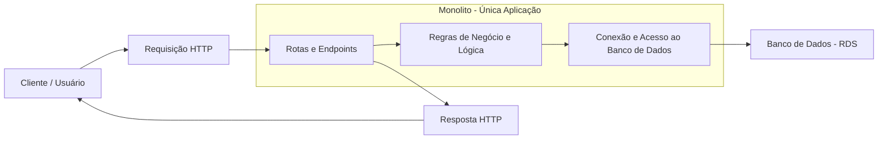

# Monolito: Vantagens e Desvantagens

## Vantagens

-   **Simplicidade**: Fácil de desenvolver, testar e implantar no inicio do projeto.
-   **CI/CD simples**: Apenas um modulo para construir, testar e publicar.
-   **Menor custo inicial**: Menos complexidade operacional e menos ferramentas necessárias.

## Desvantagens

-   **escalabilidade independente**: Não é possível escalar apenas partes específicas de um componente do sistema.
-   **Acoplamento elevado**: Mudanças em uma parte podem afetar outras inadvertidamente.
-   **deploy longos**: Uma pequena mudança exige o deploy de toda a aplicação, causando uma maior indisponibilidade de todo o sistema.
-   **Barreiras a novas tecnologias**: Difícil adotar novas linguagens, difícil realizar a refatoração. 
-   **Risco elevado**: Um bug pode derrubar toda a aplicação.
