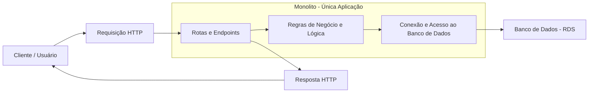

```mermaid
graph LR
    A[Cliente / Usuário] --> B[Requisição HTTP]

    subgraph "Monolito - Única Aplicação"
        C[Rotas e Endpoints] --> D[Regras de Negócio e Lógica]
        D --> E[Conexão e Acesso ao Banco de Dados]
    end

    B --> C
    E --> F[Banco de Dados - RDS]
    C --> G[Resposta HTTP]
    G --> A
```
